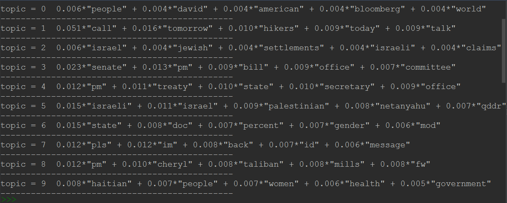

## LDA 模型应用 
### 一眼看穿希拉里的邮件

LDA（Latent Dirichlet Allocation）是一种非监督机器学习技术，可以用来识别大规模文档集（Document Collection）或语料库（Corpus）中潜藏的主题信息。每一篇文档代表了一些主题所构成的一个概率分布，而每一个主题又代表了很多单词所构成的一个概率分布。

此 LDA 实例以希拉里来往的邮件为数据来源，经过一系列的处理之后，我们可以很容易知道她在每封邮件中都聊了些什么。

希拉里的所有邮件数据都在 resources 文件夹下的 HillaryEmails.csv 文件中。

### How to use

下载并导入项目后运行 HillaryEmail.py 文件。

### 运行结果

运行成功后会得到各个主题及每个主题中高频单词的概率分布。

	

	

经过这样的训练之后，当我们再传入一个新的文本或单词的时候，就可以知道它们属于哪一个主题。

	

具体的测试代码在 HillaryEmail.py 文件中的 75 - 83 行。